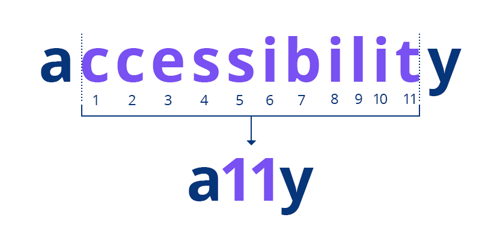

## Autres supports

Informations à intégrer:

- [CoursID412, 2023](https://eracom-id412.github.io/eedev2/a11y.html)
- [Cours ID301, 2021-22](https://eracom-id301.github.io/cours-dev2-css/a11y.html)

## Ecrire un HTML accessible

L'accessibilité réside dans la capacité d'un medium (p.ex. un site internet) à être lisible dans un maximum de situations, pour un maximum de personnes.

Le terme anglais "accessibility" étant relativement long, il est parfois abrégé en **a11y** (le 11 représentant les 11 caractères tronqués).

> l'a11y DOIT faire partie du processus de design, on doit l'enseigner comme ça, non plus se contenter de "sensibiliser" :) d'où l'importance de convaincre une corporation maintenant que c'est une part intégrante de la discipline ! - [Marie-Cécile Paccard ](https://twitter.com/mcpaccard/status/891916591407005696)

## Critères d'accessibilité

Liste d'amélioriations possibles:

1. **Lisibilité du texte:** choix d'une police lisible, taille du texte, longueur de ligne, interlignage adapté.
2. **Couleur du texte et contraste**, veiller à avoir un contraste suffisant.
3. **Taille des zones cibles tactiles**
4. **Texte alternatif:** attribut `alt` pour ajouter une description à chaque image (laisser vide si l'image est purement décorative).
5. **Lien d'évitement** (pour qu'un lecteur d'écran puisse sauter la navigation, et passer directement au contenu principal.)
6. **Code des menus** bien structuré, utilisant les éléments `nav` et `ul > li`.
7. **Utiliser les balises** H1, H2, etc, dans le bon ordre. Des outils d'assistance peuvent les utiliser pour générer une table des matières de la page.
8. **Code HTML valide:** veiller à ce que le code HTML de la page est valide (utiliser un validateur)

