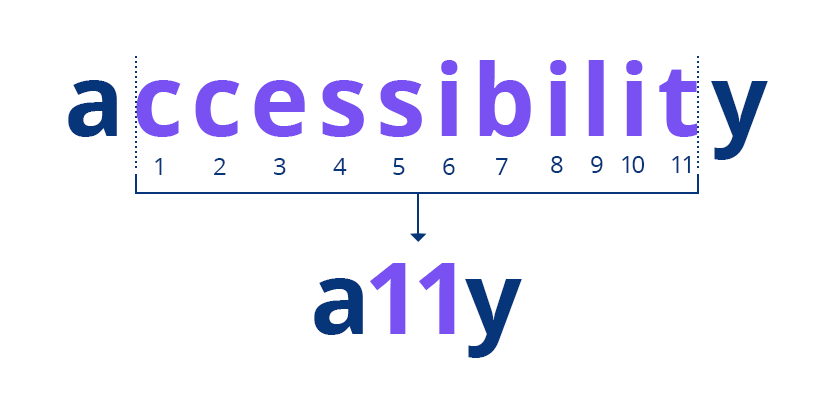

L'accessibilité réside dans la capacité d'un medium (p.ex. un site internet) à être lisible dans un maximum de situations, pour un maximum de personnes.

Le terme anglais "accessibility" étant relativement long, il est parfois abrégé en **a11y** (le 11 représentant les 11 caractères tronqués).

> l'a11y DOIT faire partie du processus de design, on doit l'enseigner comme ça, non plus se contenter de "sensibiliser" :) d'où l'importance de convaincre une corporation maintenant que c'est une part intégrante de la discipline ! - [Marie-Cécile Paccard ](https://twitter.com/mcpaccard/status/891916591407005696)

> Défendre l’accessibilité, ce n’est pas être engagé ou militant, ce n’est pas un choix ou une valeur (qui me serait propre) mais une responsabilité. - [Arnaud Malon](https://www.24joursdeweb.fr/2023/accessibilite-de-combat/)

## Critères d'accessibilité

Liste d'amélioriations possibles:

1. **Lisibilité du texte:** choix d'une police lisible, taille du texte, longueur de ligne, interlignage adapté.
2. **[Couleur du texte et contraste](couleur.html)**, veiller à avoir un contraste suffisant.
3. **[Taille des zones cibles tactiles](taille-de-cible.html)** de 44 x 44 pixels minimum.
4. **Texte alternatif:** attribut `alt` pour ajouter une description à chaque image (laisser vide si l'image est purement décorative). Aussi pour les vidéos et les tableaux. [Règle Opquast 113](https://checklists.opquast.com/fr/assurance-qualite-web/chaque-image-porteuse-dinformation-est-dotee-dune-alternative-textuelle-appropriee).
5. **[Lien d'évitement](lien-evitement.html)** (pour qu'un lecteur d'écran puisse sauter la navigation, et passer directement au contenu principal.)
6. **Code des menus** bien structuré, utilisant les éléments `nav` et `ul > li`.
7. **Utiliser les balises** H1, H2, etc, dans le bon ordre. Des outils d'assistance peuvent les utiliser pour générer une table des matières de la page. [Règle Opquast n° 227](https://checklists.opquast.com/fr/assurance-qualite-web/le-contenu-de-chaque-page-est-organise-selon-une-structure-de-titres-et-sous-titres-hierarchisee).
8. **Code HTML valide:** veiller à ce que le code HTML de la page est valide (utiliser un validateur)
9. **[Un attribut "lang"](attribut-lang.html):** veiller à ce qu'un attribut de langue soit présent.
10. **Les styles de :focus** pour aider la navigation au clavier.

Voir une checklist plus complète : [The A11Y Project Checklist](https://www.a11yproject.com/checklist/)

## Vidéos sur le sujet

[Un site internet accessible pour tous : les 5 pièges à éviter !](https://www.youtube.com/watch?v=0tTNeV_WAn8)

<iframe width="100%" style="ratio:16/9; min-height:320px" src="https://www.youtube-nocookie.com/embed/0tTNeV_WAn8" title="YouTube video player" frameborder="0" allow="accelerometer; autoplay; clipboard-write; encrypted-media; gyroscope; picture-in-picture" allowfullscreen></iframe>

Les cinq pièges, dans cette vidéo, sont:

- Lien d'évitement pour sauter la navigation, et passer au contenu.
- Les tableaux ont besoin de titres, pour être compréhensibles ([règle Opquast n°137](https://checklists.opquast.com/fr/assurance-qualite-web/les-titres-des-tableaux-de-donnees-sont-renseignes)).
- Les agendas doivent être accessibles.
- Les fenêtres pop-up peuvent poser problème, bloquer l'accès au contenu.
- Les formulaires (les messages d'erreur ne sont pas lisibles facilement).

---

[Comment les aveugles utilisent internet](https://www.youtube.com/watch?v=DePdWynmd_Y)

<iframe width="100%" style="ratio:16/9; min-height:320px" src="https://www.youtube-nocookie.com/embed/DePdWynmd_Y" title="YouTube video player" frameborder="0" allow="accelerometer; autoplay; clipboard-write; encrypted-media; gyroscope; picture-in-picture" allowfullscreen></iframe>

Problèmes récurrents cités dans cette vidéo:

- Les images sans description visible.
- Dans une boutique, quand le mode de paiement est représenté par un pictogramme non décrit.
- La navigation sans souris. Parfois, un bouton de validation n'est activable que par la souris.