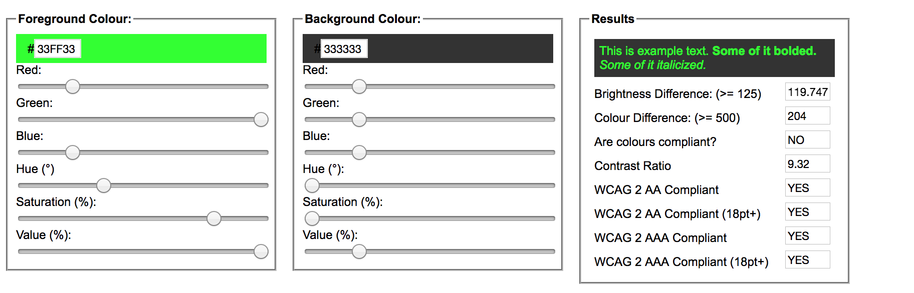

## Contraste couleur

Les **contrastes de texte** sont élémentaires en terme d’accessibilité de site internet. Les choix typographiques ainsi que les couleurs sont à faire méticuleusement afin que toute personnes souffrante d'une trouble de la vue permanent ou temporaire puisse consulter le site. Le premier terme désigne certaines déficiences visuelles, le second la fatigue oculaire dûe aux heures passées derrière un écran de mauvaise qualité par exemple. A ne pas oublier qu'avec l'âge les problèmes de vue s'accentuent. D'autres soucis de vue sont par exemple la dysléxie (8 à 12% de la population mondiale en souffrirait) ou le daltonisme (8% de cas chez les hommes et 0,5% du côté des femmes) 

Le texte est une des parties la plus importantes pour un site. Il sert à la compréhension même de celui-ci. Voilà pourquoi un bon traitement entre contrastes et couleurs est primordial.

Les recommandations de contrastes :

* Le texte (ou les images de texte informatif) de moins de 18 points (ou moins de 14 points en gras) devrait posséder un contraste de luminosité d’au moins **4,5 pour 1** avec son arrière-plan.
* Le texte (ou les images de texte informatif) de plus de 18 points (ou plus de 14 points en gras) devrait posséder un contraste de luminosité d’au moins **3 pour 1** avec son arrière-plan.

Pour obtenir le niveau le plus haut, AAA, la règle 1.4.6 indique :

* Le texte (ou les images de texte informatif) de moins de 18 points (ou moins de 14 points en gras) devrait posséder un contraste de luminosité d’au moins **7 pour 1** avec son arrière-plan.
* Le texte (ou les images de texte informatif) de plus de 18 points (ou plus de 14 points en gras) devrait posséder un contraste de luminosité d’au moins **4,5 pour 1** avec son arrière-plan.

Luminosité et différence de tonalité
===

Le calcul de contraste c’est une chose, et pour aller plus loin dans la perfection d’un site (ou autre) d’autres indicateurs sont intéressants tel que la luminosité et la différence de tonalité. Les formules pour les calculer sont très complexes. 

Toutefois on sait qu’il faut, du moins il est recommandé, d’avoir une luminosité supérieure ou égale à 125 ainsi qu’une différence de tonalité supérieure ou égale à 500 pour garantir une bonne lisibilité.

Des applications ont été mises au point pour nous faciliter ce problème. Elles nous permettent d’obtenir vite les informations que l’on veut.

En voici 4 pour étudier les contrastes de textes:

* **[Color Contrast Checker de WebAIM](https://webaim.org/resources/contrastchecker/)**  

C’est un outil de vérification de contraste de couleur. Très pratique est simple à comprendre, il affiche les valeurs de contrastes et les différences de tonalité. Cela nous permet ainsi de voir si ces dernières sont adéquates aux recommandations du WCAG. Il nous indique aussi la luminosité à avoir. 

On peut également changer en temps réel les couleurs pour voir leur impact en direct, on gagne ainsi du temps en pouvant s’adapter rapidement. 

## Autres ressources

- *[Contrastes de texte](http://openweb.eu.org/articles/accessibilite_contrastes_textes_sites)*, un article par  Nicolas Hoffmann, sur openweb.eu.org
